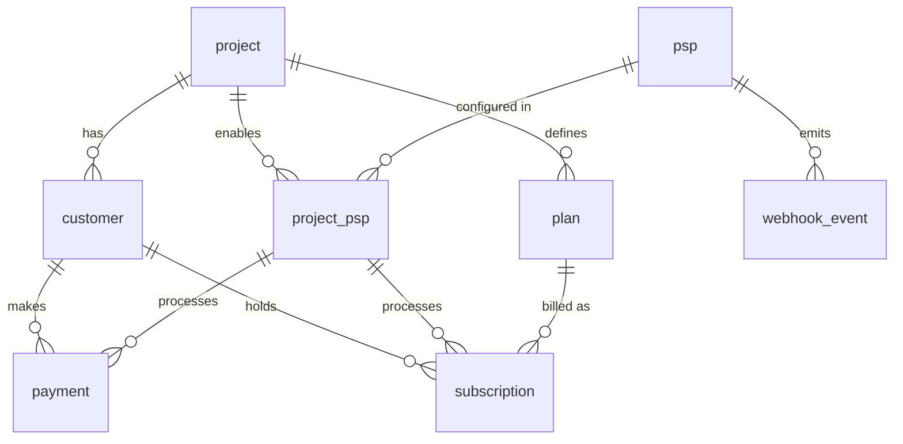

### Entity relationships (ERD)

```mermaid
erDiagram
  project        ||--o{ project_psp   : "enables"
  psp            ||--o{ project_psp   : "configured in"
  project        ||--o{ customer      : "has"
  project        ||--o{ plan          : "defines"
  customer       ||--o{ payment       : "makes"
  customer       ||--o{ subscription  : "holds"
  project_psp    ||--o{ payment       : "processes"
  project_psp    ||--o{ subscription  : "processes"
  plan           ||--o{ subscription  : "billed as"
  psp            ||--o{ webhook_event : "emits"
```
